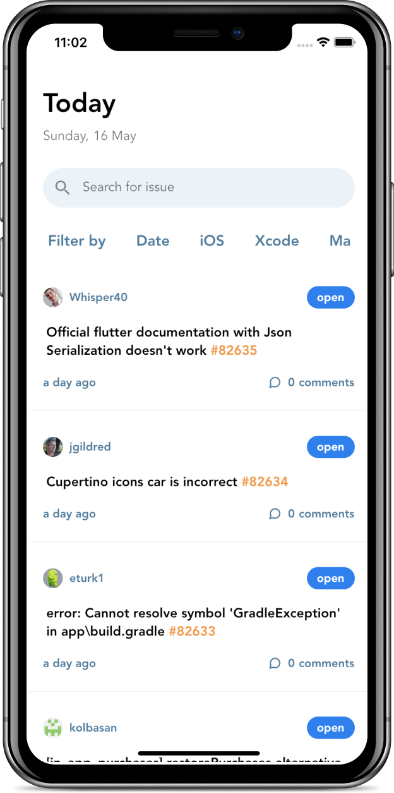

# Github Issue Tracker

Track your Github Issues using this app, as a base, you can currently only track Flutter Issues on Github. Add filters to keep yourself on the loop of the issues you're interested in. 

This was inspired by the many issues I faced while developing iOS apps using flutter. I had to keep going to the flutter issues section to check if the issues I was facing were already logged, and if so, I had to keep a track on them.

<!-- Homepage image -->

This repo includes the iOS and Android frontend of the project.
